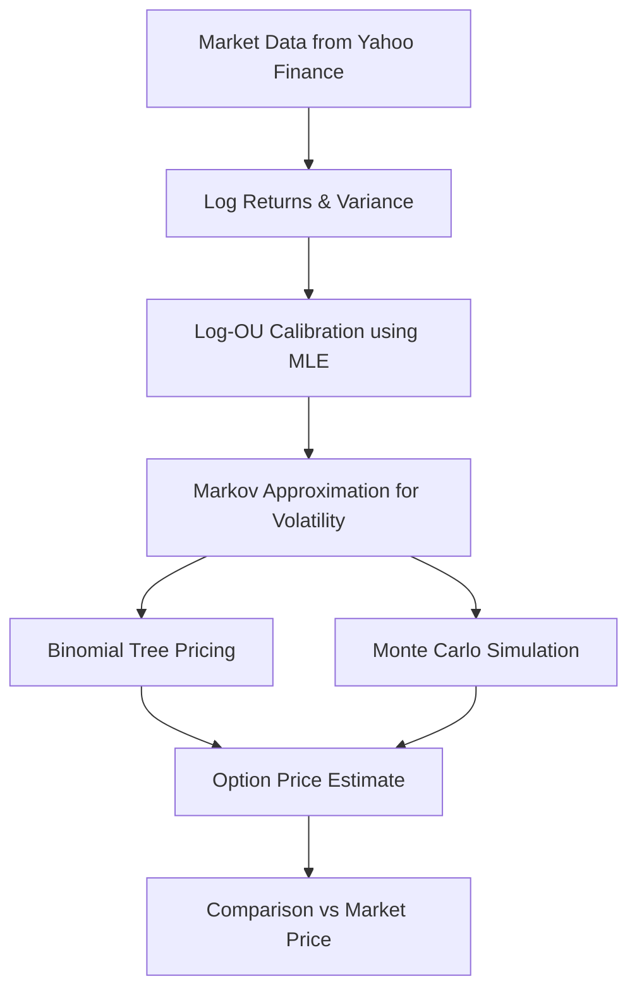

# Binomial Option Pricing with Log-Ornstein-Uhlenbeck Volatility

This project implements a **binomial tree** and **Monte Carlo simulation** to price European call options, where volatility follows a **Log-Ornstein–Uhlenbeck (Log-OU) process**. It integrates market data from Yahoo Finance (via `yfinance`) and calibrates the stochastic volatility process using **Maximum Likelihood Estimation (MLE)**.

---

## Features
- Fetches historical stock and option chain data from Yahoo Finance.
- Estimates risk-free rate from U.S. Treasury tickers.
- Robust dividend yield estimation with multiple fallbacks.
- Calibrates a **Log-Ornstein–Uhlenbeck** stochastic variance model:
  - Parameters: mean-reversion speed (**k**), long-term variance level (**θ**), and volatility of variance (**x**).
  - Calibration via **Maximum Likelihood Estimation (MLE)** with `scipy.optimize.differential_evolution`.
- Builds a **binomial tree with stochastic volatility**.
- Runs a **Monte Carlo simulation** with antithetic variates for variance reduction.
- Estimates correlation between stock returns and volatility changes.

---

## How it Works

### Pipeline Overview


### 1. Data Collection
- Historical price data for the underlying stock.
- Risk-free rate from Treasury yields (^TNX, ^IRX).
- Dividend yield from `yfinance` info and dividends history.

### 2. Log-OU Calibration
The **log-variance** is assumed to follow an **Ornstein–Uhlenbeck (OU)** process:

$$ dX_t = k(\mu - X_t)dt + x \, dW_t $$

where:
- \( X_t = \ln(v_t) \), the log of variance.
- **k** = mean reversion speed.
- **μ = ln(θ)** = long-term mean (log variance).
- **x** = volatility of volatility.

#### MLE Formulation
The conditional distribution of $( X_{t+1} $) given $( X_t $) is Gaussian:

$$ X_{t+1} \mid X_t \sim \mathcal{N}\big( X_t e^{-k\Delta t} + \mu(1 - e^{-k\Delta t}), \, \; \frac{x^2}{2k}(1 - e^{-2k\Delta t}) \big) $$

The **log-likelihood** is:

$$ \ell(k,\theta,x) = \sum_{t=1}^{T-1} \ln f(X_{t+1} \mid X_t; k, \theta, x) $$

where \( f(\cdot) \) is the normal density.

The optimizer minimizes the **negative log-likelihood** subject to parameter bounds.

#### Bounds in Calibration
- **k** ∈ [1e-3, 10] → ensures positive, realistic mean reversion.
- **θ** ∈ [1e-3, 0.5] → variance level capped at 50% annualized.
- **x** ∈ [1e-3, 0.5] → avoids degenerate or explosive volatility of variance.

### 3. Markov Approximation for Volatility
- The continuous OU distribution is approximated by discretizing into **m = 21 states**.
- Each state corresponds to a possible log-variance level.
- Transition probabilities are computed via the OU conditional distribution.
- A probability distribution over states evolves over time via the Markov transition matrix.

### 4. Binomial Tree with Stochastic Volatility
- Stock prices evolve in a recombining binomial tree.
- At each step, the **up** and **down** factors depend on the expected variance from the Markov chain.
- Backward induction prices the option.

### 5. Monte Carlo Simulation
- Simulates correlated random shocks for variance and returns.
- Uses Cholesky decomposition of the correlation matrix.
- Employs **antithetic variates** to reduce variance.
- Produces option price + confidence interval.

---

## Usage
```bash
python main.py
```

You will be prompted for:
1. Stock ticker (e.g., TSLA)
2. Number of binomial steps (e.g., 100)
3. Expiration date from available options
4. Strike selection (from list or custom)

---

## Output
- Calibrated Log-OU parameters (k, θ, x).
- Historical and current volatility.
- Risk-free rate and dividend yield.
- Nearest option strikes with bid/ask spreads.
- Binomial tree option price.
- Monte Carlo option price with 95% confidence interval.
- Comparison vs. market option price.

---

## Example
```
Calibrated Log-OU parameters: k=2.9028, θ=0.5000, x=0.2109
Calibrated annual volatility: 70.71%
Current annual volatility: 69.79%
Binomial Tree Price (Log-OU): $337.47
Monte Carlo Price (antithetic, rho=0.193): $339.28 (±$1.55 with 95% CI)
Market Price: $338.43
```

---

## Future Work
- Add **Heston model calibration** using the implied volatility surface.
- Implement a **Fourier pricing engine** (Carr–Madan or COS method) for efficient and accurate Heston pricing.

---

## Requirements
- Python 3.8+
- `yfinance`
- `numpy`
- `pandas`
- `scipy`

Install dependencies:
```bash
pip install -r requirements.txt
```

---

## License
MIT License.